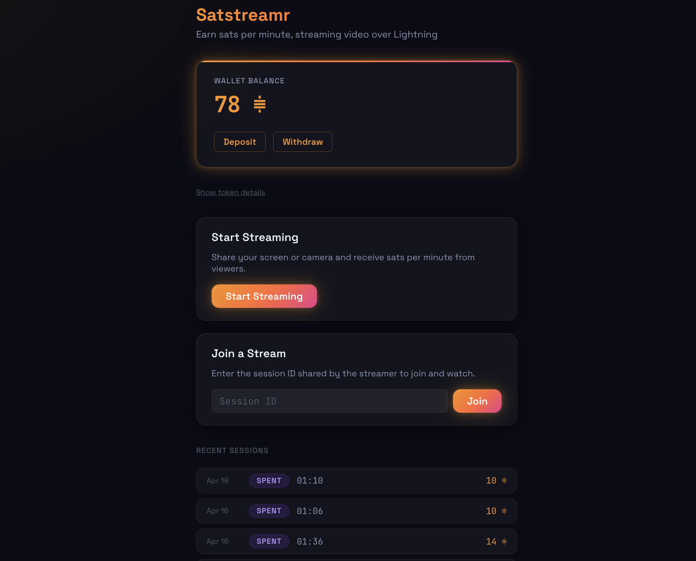

# satstreamr

Satstreamr is a peer-to-peer metered live video tutoring platform. A viewer connects directly to a tutor's browser over WebRTC and pays in Cashu e-cash micropayments sent over a WebRTC data channel — no payment processor required.



This README covers the local development setup (regtest Lightning + local mint). For production deployment behind nginx, see [INSTALL.md](INSTALL.md).

---

## Architecture

```
                        ┌─────────────────────────┐
                        │   Signaling Server       │
                        │   ws://localhost:8080    │
                        └────────┬────────┬────────┘
                                 │        │
                    offer/answer │        │ offer/answer
                                 │        │
              ┌──────────────────┘        └──────────────────┐
              │                                              │
   ┌──────────▼──────────┐    WebRTC (video +     ┌─────────▼───────────┐
   │  Browser (Tutor)    │◄──── data channel) ───►│  Browser (Viewer)   │
   │  :5173/room.html    │                         │  :5173/room.html    │
   └─────────────────────┘                         └─────────────────────┘
              ▲                                              │
              │  Cashu tokens over WebRTC data channel       │
              └──────────────────────────────────────────────┘

   Supporting services:

   ┌──────────────────────┐        ┌──────────────────────────┐
   │  Nutshell Mint       │        │  Coturn TURN Server      │
   │  http://localhost:   │        │  UDP/TCP port 3478       │
   │  3338                │        │  (relay for symmetric    │
   │  (Cashu e-cash mint) │        │   NAT environments)      │
   └──────────────────────┘        └──────────────────────────┘
              ▲
              │  LND REST (regtest)
   ┌──────────┴───────────┐
   │  Docker Compose      │
   │  bitcoind (regtest)  │
   │  lnd_mint  :8081     │
   │  lnd_customer :8082  │
   └──────────────────────┘
```

---

## Prerequisites

| Dependency | Minimum version | Notes |
|---|---|---|
| Node.js | 18+ | Required for frontend and signaling server |
| npm | 9+ | Bundled with Node.js 18 |
| Python | 3.11+ | Required for Nutshell Cashu mint |
| Docker + Docker Compose | Docker 24+ | Runs the regtest Lightning stack |
| coturn | any recent | `apt install coturn` (Linux) or `brew install coturn` (macOS) |
| Polar | latest | Optional — GUI for the Lightning nodes (macOS/Linux desktop only) |

---

## Quick Start

Work through the steps in order. Each service depends on the previous one being healthy.

### Step 1: Start the regtest Lightning stack

```bash
cd /path/to/satstreamr/infra
docker compose up -d
bash bootstrap-regtest.sh
```

`bootstrap-regtest.sh` is idempotent — safe to re-run. It waits for bitcoind and both LND nodes to become ready, mines initial blocks, funds each node, opens a channel between them, and extracts `lnd_mint` credentials to `infra/lnd-mint-creds/`.

**Services started:**

| Container | Host port | Purpose |
|---|---|---|
| `bitcoind` | 18443 (RPC) | Regtest Bitcoin node |
| `lnd_mint` | 8081 (REST), 10009 (gRPC) | LND node backing the Cashu mint |
| `lnd_customer` | 8082 (REST), 10010 (gRPC) | LND node used by the viewer browser |

### Step 2: Start the Nutshell Cashu mint

```bash
cp infra/nutshell.env.example infra/nutshell.env
```

Edit `infra/nutshell.env` and set:

- `MINT_BACKEND_BOLT11_SAT=LndRestWallet`
- `LND_REST_ENDPOINT=https://127.0.0.1:8081`
- `MINT_LND_REST_CERT=` absolute path to `infra/lnd-mint-creds/tls.cert`
- `MINT_LND_REST_MACAROON=` hex string from `xxd -p -c 1000 infra/lnd-mint-creds/admin.macaroon`
- `CASHU_DIR=` absolute path to a local directory for mint storage (e.g. `/home/<you>/Development/satstreamr/infra/cashu-data`)
- `MINT_PRIVATE_KEY=` output of `openssl rand -hex 32`

You also need a Python virtual environment with Nutshell installed:

```bash
cd infra
python3 -m venv nutshell-venv
nutshell-venv/bin/pip install cashu==0.19.2
```

Then start the mint:

```bash
bash infra/start-mint.sh   # mint listens on http://localhost:3338
```

### Step 3: Start the Coturn TURN server

```bash
cp infra/coturn.env.example infra/coturn.env
```

Edit `infra/coturn.env` and set:

```
TURN_SHARED_SECRET=<output of: openssl rand -hex 32>
```

Then start coturn:

```bash
bash infra/start-coturn.sh   # TURN listens on port 3478
```

Keep this terminal open or run it as a background process. Coturn logs go to `/var/log/coturn/coturn.log`.

### Step 4: Start the signaling server

The signaling server lives in a separate repository (`satstreamr-signaling`). Clone it alongside `satstreamr` if you have not already:

```bash
git clone https://github.com/bilthon/satstreamr-signaling.git
```

Then start it, passing the same shared secret used in Step 3:

```bash
cd satstreamr-signaling/signaling
npm install
TURN_SHARED_SECRET=<same secret from coturn.env> TURN_HOST=localhost npm run dev
# signaling server listens on ws://localhost:8080
```

### Step 5: Start the frontend

No env file is required — Vite's dev proxy routes `/mint` to `localhost:3338` and `/ws` to `localhost:8080` automatically. Optionally copy `.env.example` to `.env` if you need to override any defaults.

```bash
cd frontend
npm install
npm run dev
```

Open the app at [http://localhost:5173/](http://localhost:5173/). From the home page:

- Click **Start streaming** to become a tutor — you'll land on `/room.html` and can create a session
- Click **Join a stream** (or paste a session ID/invite URL) to become a viewer

Both roles are served by the same `/room.html` — the presence of a `?session=…` query param determines the role.

---

## Environment Variables Reference

### `infra/nutshell.env`

| Variable | Required | Description | Example |
|---|---|---|---|
| `MINT_BACKEND_BOLT11_SAT` | Yes | Wallet backend for BOLT-11 payments | `LndRestWallet` |
| `MINT_URL` | Yes | Public URL of the mint | `http://127.0.0.1:3338` |
| `MINT_PORT` | Yes | Port the mint listens on | `3338` |
| `MINT_HOST` | Yes | Bind address | `0.0.0.0` |
| `MINT_PRIVATE_KEY` | Yes | 32-byte hex key for the mint | `openssl rand -hex 32` |
| `CASHU_DIR` | Yes | Absolute path for mint data storage | `/home/you/satstreamr/infra/cashu-data` |
| `MINT_LND_REST_ENDPOINT` | Yes (LndRestWallet) | LND REST API URL | `https://127.0.0.1:8081` |
| `MINT_LND_REST_CERT` | Yes (LndRestWallet) | Absolute path to LND TLS cert | `/home/you/satstreamr/infra/lnd-mint-creds/tls.cert` |
| `MINT_LND_REST_MACAROON` | Yes (LndRestWallet) | Hex-encoded admin macaroon | `0201...` |

### `frontend/.env`

All variables are optional. If unset, the frontend uses Vite's dev proxy to reach the mint and signaling server on the same origin.

| Variable | Required | Description | Example |
|---|---|---|---|
| `VITE_SIGNALING_URL` | No | Override the signaling WebSocket URL | `wss://stream.example.com/ws` |
| `VITE_MINT_URL` | No | Override the Cashu mint URL | `https://mint.example.com` |
| `VITE_LND_CUSTOMER_MACAROON_HEX` | No (test-only) | Hex-encoded admin macaroon for `lnd_customer`, used by integration tests | `0201...` |

---

## Running Tests

### Signaling server tests

```bash
cd satstreamr-signaling/signaling
npm run build
npm test
```

Uses Jest. Runs 10 tests covering WebSocket message handling and session management. All 10 should pass.

### Frontend unit tests

```bash
cd frontend
npm test
```

Uses Vitest. Covers the Cashu wallet module and data channel helpers.

---

## Gate Verification Checklist

To manually smoke-test an end-to-end session:

**Gate 1 — Wallet round-trip**
On the home page, click **Deposit**, generate an invoice for a few hundred sats, and pay it from a Lightning wallet (in regtest, use `lnd_customer`). The balance should update with no errors. Then click **Withdraw** and pay a fresh invoice back out — balance returns to zero minus fees.

**Gate 2 — WebRTC peer connection**
Start all services. Open `/room.html` in one tab (tutor) and paste the session ID/invite URL into a second tab (viewer). The viewer tab should show "Connected" and display the tutor's video stream. Check the browser console for `iceConnectionState: "connected"`.

**Gate 3 — Cashu token over data channel**
With a live Gate 2 session, watch the browser console. Within ~10 seconds the viewer should log "token sent" and the tutor should log "token claimed". Balances in both wallets update accordingly.

**Gate 4 — Payment scheduler runs for 60 seconds**
Keep the Gate 3 session running for at least 60 seconds without closing either tab. Confirm payment chunks continue to be logged at approximately 10-second intervals with no missed chunks or double-spend errors.

---

## Repo Structure

```
satstreamr/                      # This repository
  frontend/                      # Vite + TypeScript browser app
    src/                         #   Source modules (wallet, datachannel, signaling)
    index.html                   #   Home page (wallet, deposit/withdraw, session entry)
    room.html                    #   Unified tutor/viewer page (role determined by ?session=)
    .env.example                 #   Frontend environment variable template
  INSTALL.md                     # Production deployment guide (nginx + systemd)
  infra/                         # Docker Compose, mint, and TURN config
    docker-compose.yml           #   bitcoind + lnd_mint + lnd_customer
    bootstrap-regtest.sh         #   Idempotent regtest network setup script
    nutshell.env.example         #   Mint environment variable template
    coturn.env.example           #   Coturn environment variable template
    start-mint.sh                #   Starts the Nutshell mint
    start-coturn.sh              #   Starts the Coturn TURN server
    lnd-mint-creds/              #   Auto-generated by bootstrap script (git-ignored)
  planning/                      # Unit plans and STATUS.md

satstreamr-signaling/            # Separate repository
  signaling/                     # WebSocket signaling server (Node.js + ws)
    src/server.ts                #   Server entry point
    test/                        #   Jest test suite (10 tests)
    package.json
```

---

## Payment Flow

1. **Deposit:** The viewer funds their wallet by minting Cashu tokens against the Nutshell mint, paying a Lightning invoice from any wallet.
2. **Pre-split:** At session start, the viewer performs a NUT-03 swap to split the wallet balance into exact-denomination chunks (one per payment interval). This avoids per-tick mint calls during streaming.
3. **Send:** The payment scheduler sends one plain unlocked token per interval (~10 s) over the WebRTC data channel.
4. **Claim:** The tutor's browser claims each received token via a NUT-03 swap against the mint, converting it to fresh unspent proofs stored in the tutor's wallet.
5. **Acknowledge:** The tutor sends a data-channel acknowledgement back to the viewer. If no ACK arrives within the timeout, the viewer pauses the stream.
6. **Cash-out / Withdraw:** Either party can sweep their wallet to a Lightning invoice at any time using the withdraw UI (NUT-05 melt).

---

## Troubleshooting

**ICE stuck in "checking" — stream never starts**
Coturn is not running or `TURN_SHARED_SECRET` in the signaling server does not match `coturn.env`. Verify `bash infra/start-coturn.sh` is running and both processes use the same secret.

**Mint returns HTTP 500 on mint/melt requests**
`lnd_mint` is not connected or has no channel balance. Run `docker exec lnd_mint lncli --network=regtest getinfo` to check sync state and `listchannels` to verify an active channel exists. Re-run `bash infra/bootstrap-regtest.sh` if needed.

**Data channel never opens**
A firewall is blocking direct WebRTC traffic and the TURN relay is also unreachable. Ensure UDP port 3478 is accessible from both browser tabs. On a single machine this is loopback — verify coturn is actually running.

**Double-spend error on first payment after a page reload**
Stale proof state in `localStorage` from an interrupted previous session. Open DevTools > Application > Local Storage, clear the `satstreamr-*` keys, then reload. Note that this also wipes your wallet balance.

**WebSocket disconnects and does not reconnect on mobile**
Chrome and Safari on mobile aggressively suspend background tabs. The signaling client uses exponential backoff reconnection, but a fully frozen tab cannot execute JavaScript. Keep the browser tab in the foreground during a session.

**`start-mint.sh` fails with "No such file or directory: nutshell-venv/bin/mint"**
The Python virtual environment has not been created. See Step 2 for the `python3 -m venv` and `pip install cashu==0.19.2` commands.

---

## Known Limitations

- **Single viewer per session.** The signaling protocol supports exactly one tutor and one viewer per room.
- **No authentication.** Any client can join any room by knowing the session ID.
- **Single mint per session.** Both tutor and viewer must use the same mint URL. The frontend enforces this and shows a blocking overlay on mismatch.
- **No session recording.** Screen/video recording is not yet implemented.
- **iOS Safari limitations.** WebRTC data channel behaviour on iOS Safari may be unreliable; desktop Chrome/Firefox/Safari and Android Chrome are the tested configurations.
- **Dev environment uses regtest.** The `infra/` stack spins up a local Docker regtest Lightning network. Production deployments (see [INSTALL.md](INSTALL.md)) use a real mainnet mint.
- **Local coturn has no TLS.** The `infra/start-coturn.sh` dev config runs with `--no-tls --no-dtls`. For production, configure TLS on coturn before exposing to the public internet.

---

## License

MIT
